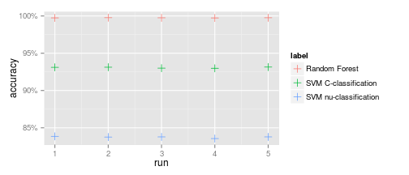
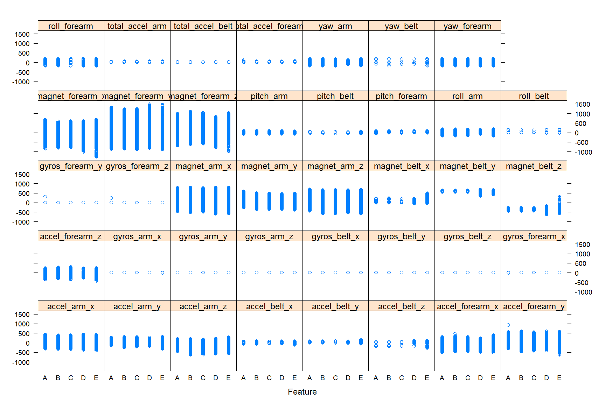
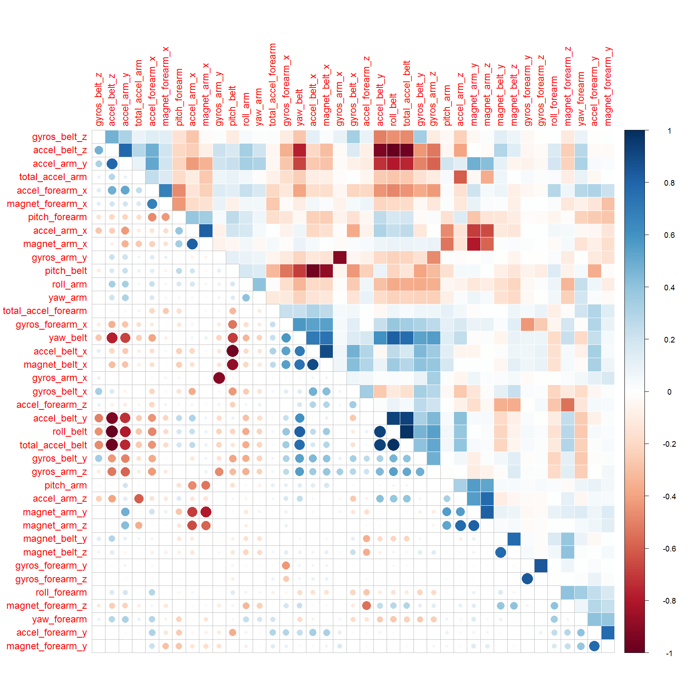
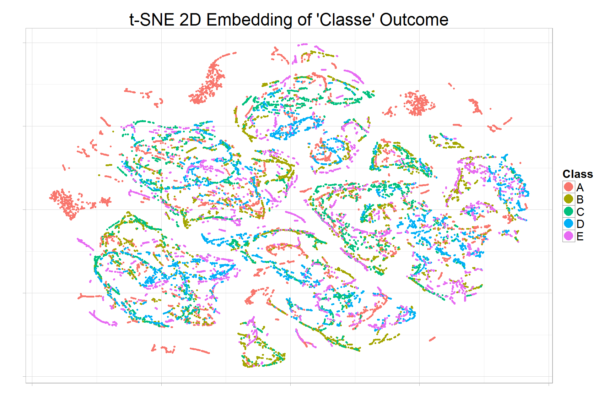
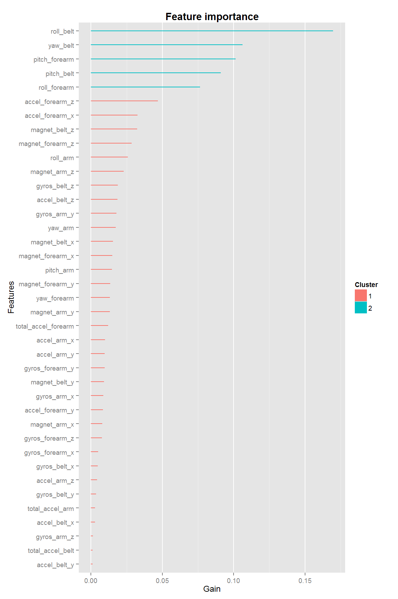

# Prediction Assignment Writeup

## Acknowledgements

> The data set used here is from the *Weight Lifting Exercise Dataset*.
> The original research that produced this data set is published at:

> Velloso, E.; Bulling, A.; Gellersen, H.; Ugulino, W.; Fuks, H. *Qualitative Activity Recognition of
> Weight Lifting Exercises*. **Proceedings of 4th International Conference in Cooperation with SIGCHI
> (Augmented Human '13)**. Stuttgart, Germany: ACM SIGCHI, 2013.

> Read more: [*Groupware@LES* website](http://groupware.les.inf.puc-rio.br/har#wle_paper_section#ixzz3H78SvjmM).

## Background

This data set was created by measuring several individuals performing a
weight lifting exercise, in one of several ways: correctly, and while making
one of several common mistakes.

Various physical measurements of their movement were made recording position,
momentum, orientation, of several body parts. The goal was to be able to detect
whether the exercise is performed correctly, or detect a specific mistake,
based on these physical measurements.

To simplify the analysis, the raw digital signals were summarized by some
summary statistics over various time-slices.

## Analysis

For this course assignment we are provided with some subset of this data,
with labeled outcomes (the file `pml-training.csv`), as well as 20 cases
(the file `pml-testing.csv`), whose outcomes are unlabeled
and we have to guess.

We describe below each step of the analysis performed:

### Loading and cleaning the data

We find that the data contains mostly numerical features. However, many of
them contain nonstandard coded missing values. In addition to the standard
`NA`, there are also empty strings `""`, and error expressions `"#DIV/0!"`.

In addition, there is one column `cvtd_timestamp` that contains a time-stamp
as a string value, in a European format `DD/MM/YYYY HH:MM`.

Finally, there are several categorical variables:

* The outcome variable `classe` with values `A`, `B`, `C`, `D`, and `E`.
* The variable `user_name`  which specifies which subject was performing the
  exercise.
* The variable `new_window` describing whether a particular time slice is part
  of a new moving window.
  
A final peculiarity is that several numerical variables contain only missing
values. When read by `read.csv()`, these are assigned the logical type, which
we need to manually convert.


```r
library(ggplot2)
library(scales)
library(dplyr)
```

```
## 
## Attaching package: 'dplyr'
## 
## The following object is masked from 'package:stats':
## 
##     filter
## 
## The following objects are masked from 'package:base':
## 
##     intersect, setdiff, setequal, union
```

```r
library(caret)
```

```
## Loading required package: lattice
```

```r
library(e1071)
library(randomForest)
```

```
## randomForest 4.6-10
## Type rfNews() to see new features/changes/bug fixes.
```

```r
library(lubridate)
```


```r
all_data <-
  read.csv('pml-training.csv', row.names = 1, stringsAsFactors = FALSE,
           na.strings = c("NA", "", "#DIV/0!")) %>%
  mutate(cvtd_timestamp = mdy_hm(cvtd_timestamp),
         user_name      = as.factor(user_name),
         new_window     = as.factor(new_window),
         classe         = as.factor(classe))

testing_data <-
  read.csv('pml-testing.csv', row.names = 1, stringsAsFactors = FALSE,
           na.strings = c("NA", "", "#DIV/0!")) %>%
  mutate(cvtd_timestamp = mdy_hm(cvtd_timestamp),
         user_name      = as.factor(user_name),
         new_window     = as.factor(new_window))
```

### Training and validation sets

To properly assess model performance, we separate our data set (the
contents of `pml-training.csv`) into a training set containing 60% of the
data, and a validation set containing 40% of the data. The validation set is
held out until the very end, and all model selection uses the testing set only.


```r
train_percentage <- .6

set.seed(3251)
train_index <- createDataPartition(y = all_data$classe,
                                   p = train_percentage,
                                   list = FALSE)
train_set      <- all_data[train_index, ]
validation_set <- all_data[-train_index, ]
```

### Exploratory analysis

Next, we perform exploratory analysis *on the training set only*.

The first step is to check for missing values. In addition to the variables
discovered during cleaning to contain only missing values, we find many variables
to contain almost exclusively missing values (upwards of 95% of all values).

This suggests that in any model we only include any variables that contain no
missing values. This leaves us with a little over a third of the variables left:
58 out of 158 feature variables.

### Model selection

We tested three models, selected due to low training time. Since we end up with
acceptable performance, we do not test more complicated models.

For each of the three models, the fitting strategy is as follows:

1. Pre-process the data: strip all feature variables with any missing values.
2. Fit the model with default parameters (we perform no tuning).

To assess model performance, in each case we use repeated cross-validation:

1. In each repetition we perform 10-fold cross-validation. This gives a good
   estimate for the out-of-sample accuracy.
2. Since each repetition only predicts on each test case once, we repeat the
   whole process 5 time to detect any variability (instability of the fitting
   method).
3. Due to the very simple pre-processing we use, this is only a minor concern,
   but can be more important generally. We do all the pre-processing only *after*
   splitting into folds.

The models we try are:

1. **Random Forest.** We use the `randomForest()` function from the `randomForest`
   package with all default arguments.
2. **Support Vector Machine (SVM) using C-classification.** We use the `svm()`
   function from the `e1071` package with all default arguments.
3. **SVM using nu-classification.** We use the `svm()` function from the `e1071`
   package with default arguments, except for `type = "nu-classification"`.

We show the procedure Random Forest. The other two work the same.


```r
set.seed(1837)

accuracy_rf <- numeric(5)
for (j in 1:5) {
  # Splits into 10 folds.
  folds <- createFolds(y = train_set$classe, k = 10, list = FALSE)
  correct <- logical(nrow(train_set))
  for (i in 1:10) {
    # Split into training and validation sets
    # =======================================
    train_subset <- train_set[folds != i, ]
    test_subset  <- train_set[folds == i, ]

    # Pre-processing
    # ==============

    # Remove features with missing values
    missing <- is.na(train_subset)
    keep_columns <- names(which(colSums(missing) == 0))
    train_subset <- train_subset[, keep_columns]
    test_subset  <- test_subset[, keep_columns]

    # Fit the model
    # =============
    model <- randomForest(classe ~ ., data = train_subset)

    # Record which guesses are correct
    # ================================
    predictions <- predict(model, newdata = test_subset)
    correct[folds == i] <- (predictions == test_subset$classe)
  }
  # Accuracy for the j-th iteration
  accuracy_rf[j] <- mean(correct)
}
```


We find that all three models perform in a very stable manner, reflected by
low standard deviation of the resulting accuracy for each repetition:

* 0.0134% for Random Forest,
* 0.0756% for SVM with C-classifier, and
* 0.111% for SVM with nu-classifier.

However, the average performance is very different.
We find that the Random Forest classifier has extremely high accuracy:

* 99.8%,

while both SVM variations perform worse:

* 93.1% for SVM with C-classifier.
* 83.7% for SVM with nu-classifier.

We give a brief plot of all runs:

 
 
 
 
 

### Final model

Due to the above method we pick Random Forest as the final model. Since we used
the entire training set in the cross-validations from the previous step, the
accuracy estimates are only accurate as comparisons. To get a new, unbiased
estimate for the final model, we need to use a fresh data set. This is the
validation set, which has not been touched so far.

We fit the final model on the entire training set and asses accuracy on the
validation set:


```r
set.seed(23756)

# Remove missing variables
missing              <- is.na(train_set)
keep_columns         <- names(which(colSums(missing) == 0))
train_processed      <- train_set[, keep_columns]
validation_processed <- validation_set[, keep_columns]

# Fit the model
# =============
model <- randomForest(classe ~ ., data = train_processed)

# Record which guesses are correct
# ================================
predictions <- predict(model, newdata = validation_processed)
cm <- confusionMatrix(data = predictions, reference = validation_processed$classe)
```

We get an accuracy estimate of
99.9%. More generally,
we can see some statistics of the fit here:


```
## Confusion Matrix and Statistics
## 
##           Reference
## Prediction    A    B    C    D    E
##          A 2232    0    0    0    0
##          B    0 1518    3    0    0
##          C    0    0 1361    1    0
##          D    0    0    4 1285    0
##          E    0    0    0    0 1442
## 
## Overall Statistics
##                                          
##                Accuracy : 0.999          
##                  95% CI : (0.998, 0.9996)
##     No Information Rate : 0.2845         
##     P-Value [Acc > NIR] : < 2.2e-16      
##                                          
##                   Kappa : 0.9987         
##  Mcnemar's Test P-Value : NA             
## 
## Statistics by Class:
## 
##                      Class: A Class: B Class: C Class: D Class: E
## Sensitivity            1.0000   1.0000   0.9949   0.9992   1.0000
## Specificity            1.0000   0.9995   0.9998   0.9994   1.0000
## Pos Pred Value         1.0000   0.9980   0.9993   0.9969   1.0000
## Neg Pred Value         1.0000   1.0000   0.9989   0.9998   1.0000
## Prevalence             0.2845   0.1935   0.1744   0.1639   0.1838
## Detection Rate         0.2845   0.1935   0.1735   0.1638   0.1838
## Detection Prevalence   0.2845   0.1939   0.1736   0.1643   0.1838
## Balanced Accuracy      1.0000   0.9998   0.9974   0.9993   1.0000
```
### Applying the final model

Finally, we apply the model to the 20 unlabeled assignment cases. For this
we train the model on all labeled cases (both the training and validation set).
Note that generally over-fitting decreases with increased sample size, and we
are now increasing the sample size by 67% (from 60% to 100% of the available cases).
Thus the estimate of out-of-sample error from the previous section is probably
too pessimistic.

### All the details
The original code used all the analysis (including dead ends) is available
in the repository in the following files (corresponding roughly to sections
of this write-up):

* `0_get_data.R`: Downloading the data, if necessary. 
* `1_load_and_clean.R`: Load the data with appropriate variable types,
  and separate into testing and validation sets.
* `2_explore.R`: Exploratory analysis.
* `3_1_randomForest.R`, `3_2_svm_C_classification.R`, and `3_3_svm_nu_classification.R`: Repeated CV
  for each model.
* `4_final_model_evaluation.R`: Evaluation of Random Forest on the validation set.
* `5_final_model_application.R`: Predict the 20 assignment cases.

### Further thoughts

During the exploratory analysis we found that the numerical features are
overwhelmingly predicted by the variable `user_name`. In other words
between-subject variability is much higher than intra-subject variability.

For this project both the training and testing cases are labeled by subject
(and contain the same subjects).
However, in a real-world scenario, a much more plausible scenario is to train
the algorithm on several subjects, but then apply it to new, unseen
subjects. In that case the appropriate strategy for model building would be
to separate the majority of the subjects to the training set, and leave a few
for the validation set. In addition, the model should not depend on a subject
label (or other variables strongly correlated to it, like the time-stamps
in this case).
